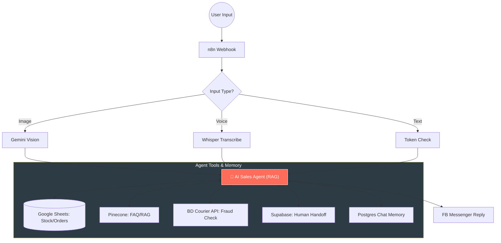
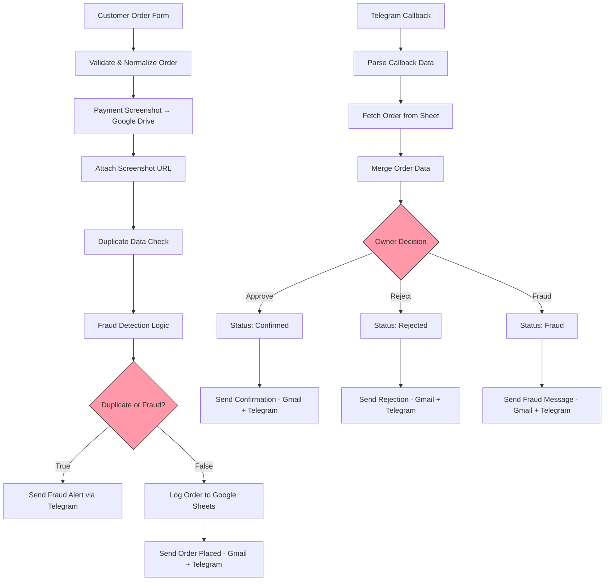
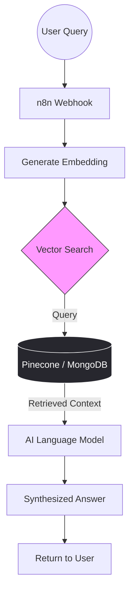
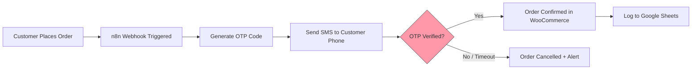
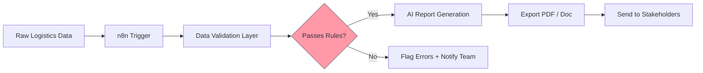
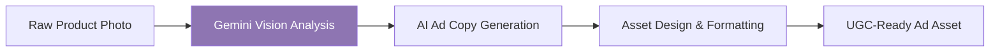
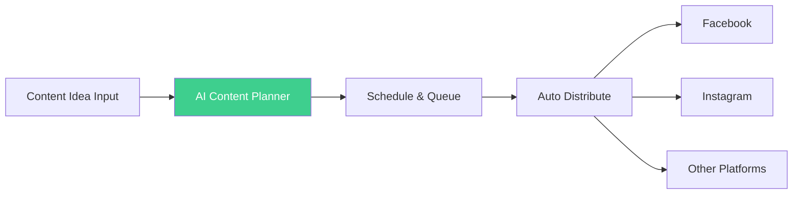
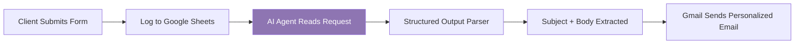

# Hey, I'm Uba Chan 👋

**AI Integrator & Automation Architect**

I build systems that handle the work businesses are still doing by hand.

Law firms chasing client intake. E-commerce brands checking payments manually. Clinics booking appointments through phone calls. Real estate teams following up on leads one by one. The bottleneck is almost always the same — too much manual work, not enough automation.

---

## What I Build

| Area | What it means in practice |
| :--- | :--- |
| **🤖 Custom AI Agents & Chatbots** | Context-aware systems for lead gen, client support, and decision-making — running 24/7 |
| **⚡ Workflow Automation** | n8n and Zapier pipelines that connect your tools and eliminate repetitive tasks |
| **🔗 CRM Integration** | Pipelines that keep deals moving without someone pushing them |
| **🌐 Web & SaaS Development** | Production-ready products built around automation from day one |
| **🗄️ Database & Backend** | Supabase architecture built for scale and real-time performance |

---

## Industries

⚖️ Law Firms &nbsp;·&nbsp; 🏠 Real Estate &nbsp;·&nbsp; 🏥 Clinics &nbsp;·&nbsp; 🛍️ E-commerce &nbsp;·&nbsp; 💼 Agencies &nbsp;·&nbsp; 🚀 SaaS

---

## Projects

### 1. AI Sales Agent — Omni-Channel Facebook Messenger Automation

An autonomous sales agent for Facebook Messenger that handles the full sales cycle — product questions via text, voice, or photo — through to inventory checking, fraud detection, and order placement. Transfers to a human agent when the situation needs it.

**Stack:** n8n · OpenAI · Google Gemini · Supabase · Pinecone · Postgres

**Key Features:**
- Gemini Vision identifies products from customer photos
- OpenAI Whisper transcribes and understands voice notes in real time
- Real-time inventory sync with Google Sheets — checks stock before confirming
- BD Courier API fraud scoring on COD orders before acceptance
- Pinecone vector DB for FAQ and policy retrieval
- Postgres memory keeps conversation context across sessions
- Supabase-triggered human handoff when complex support is needed

**Repo:** [AI-Sales-Agent-Omni-Channel-Automation](https://github.com/ubachan/AI-Sales-Agent-Omni-Channel-Automation.git)

---

### 2. From DM to Delivered — Zero Website Order Flow

A full order management system for businesses selling through Instagram or Facebook DMs. No Shopify. No website. Customers submit orders through a form, payment screenshots upload to Google Drive automatically, fraud detection runs, and the owner approves or rejects from Telegram in one tap.

**Results:** 40hrs/week → 2hrs &nbsp;·&nbsp; 12 fake orders/week → 0 &nbsp;·&nbsp; 25,430+ orders processed &nbsp;·&nbsp; 99.1% verification rate &nbsp;·&nbsp; <1.5s response time

**Stack:** n8n · Airtable · Google Drive · Google Sheets · Gmail · Telegram Bot

**Repo:** [From-DM-to-Delivered-Zero-Website-Order-Flow](https://github.com/ubachan/From-DM-to-Delivered-Zero-Website-Order-Flow)

---

### 3. Agentic RAG — Intelligent Knowledge Base

An AI agent that retrieves contextually relevant answers from a custom database using vector search. Built for businesses that need a chatbot trained on their own data — not generic internet knowledge.

**Stack:** n8n · Pinecone · Groq · MongoDB

**Key Features:**
- Intent recognition before retrieval
- Dynamic context injection based on query similarity
- Low-latency responses via Groq inference
- Works with any structured or unstructured business data

**Use Case:** Custom AI chatbots for law firms, clinics, and agencies that need to answer questions from their own documents and policies.

---

### 4. Automated WooCommerce OTP Fraud Prevention

An OTP verification layer for WooCommerce that blocks fake orders before they reach fulfillment. Verifies customer phone numbers at checkout via automated SMS, adds a confirmation step that most fraud bots and fake buyers won't complete.

**Stack:** n8n · WooCommerce · SMS API · Google Sheets

**Repo:** [Automated-WooCommerce-OTP-Fraud-Prevention-System](https://github.com/ubachan/Automated-WooCommerce-OTP-Fraud-Prevention-System)

---

### 5. AI Logistics Report — Documentation & Validation

An automated pipeline that processes logistics data, validates it against business rules, flags errors, and generates structured reports. Removes the manual spreadsheet work from operations and compliance teams.

**Stack:** n8n · Google Sheets · AI Model · PDF/Doc generation

**Repo:** [AI-Logistics-Report-Documentation-Validation](https://github.com/ubachan/AI-Logistics-Report-Documentation-Validation)

---

### 6. NBGC — Photos to UGC Ads

An automation pipeline that takes raw product photos and turns them into UGC-style ad content using AI vision and copy generation. Built for marketing agencies producing high volumes of creative assets.

**Stack:** n8n · Google Gemini · Cloudflare

**Live:** [nbgc.pages.dev](https://nbgc.pages.dev/)

---

### 7. UreatorFlow — AI Operating Studio for Solo Creators

An AI-powered studio that manages the full content workflow for solo creators — planning, scheduling, and distribution in one automated system.

**Stack:** n8n · Supabase · Lovable

**Live:** [ureatorflow.pages.dev](https://ureatorflow.pages.dev/)

---

### 8. AI Vibe — Client Intake Automation

A consultation form that sends personalized reply emails automatically. When a client submits their request, an AI Agent reads it, writes a tailored email based on their specific service interest, and Gmail delivers it within seconds. No manual follow-up needed.

**Stack:** n8n · Google Gemini · Google Sheets · Gmail · Structured Output Parser

**Repo:** [AI-Vibe-Client-Intake-Automation](https://github.com/ubachan/AI-Vibe-Client-Intake-Automation)

---

## Currently

- 🔨 **Building:** [UreatorFlow](https://ureatorflow.pages.dev/) — AI operating studio for solo creators &nbsp;·&nbsp; [NBGC](https://nbgc.pages.dev/) — product photos to UGC ads
- 📚 **Learning:** Multi-Agent Orchestration and scaling SaaS with n8n + Supabase
- 🤝 **Open to:** Freelance projects and open-source automation collaboration
- 💬 **Ask me about:** n8n, AI Agents, Supabase, CRM integrations, Telegram bots

---

## Tech Stack

| Category | Tools |
| :--- | :--- |
| **Automation** |     |
| **AI & LLM** |      |
| **AI Frameworks** |    |
| **CRM & Comms** |    |
| **Database** |    |
| **Web Dev** |     |
| **Dev Tools** |    |

---

## GitHub Stats

---

## Connect

Solo engineer. Select projects. Deep work.

